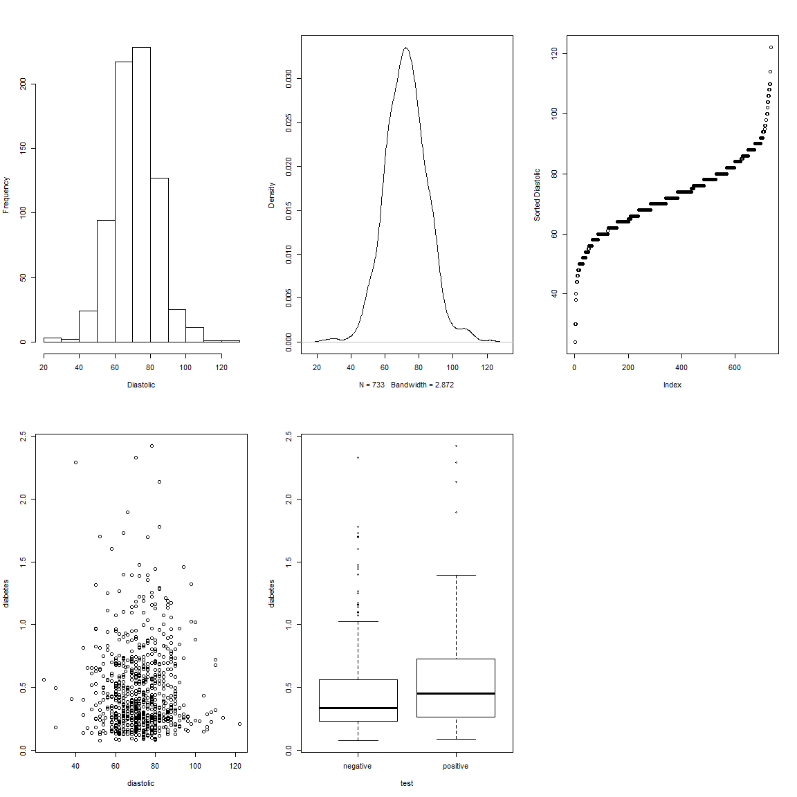
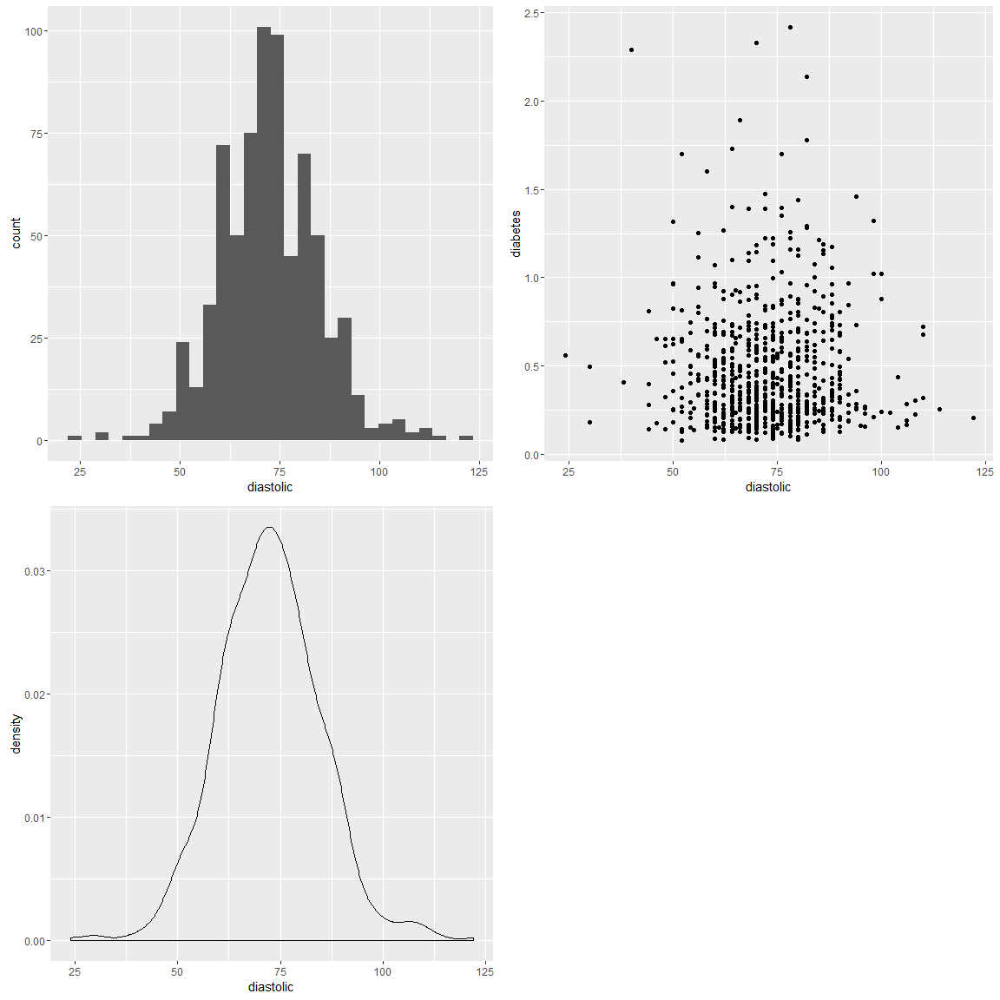
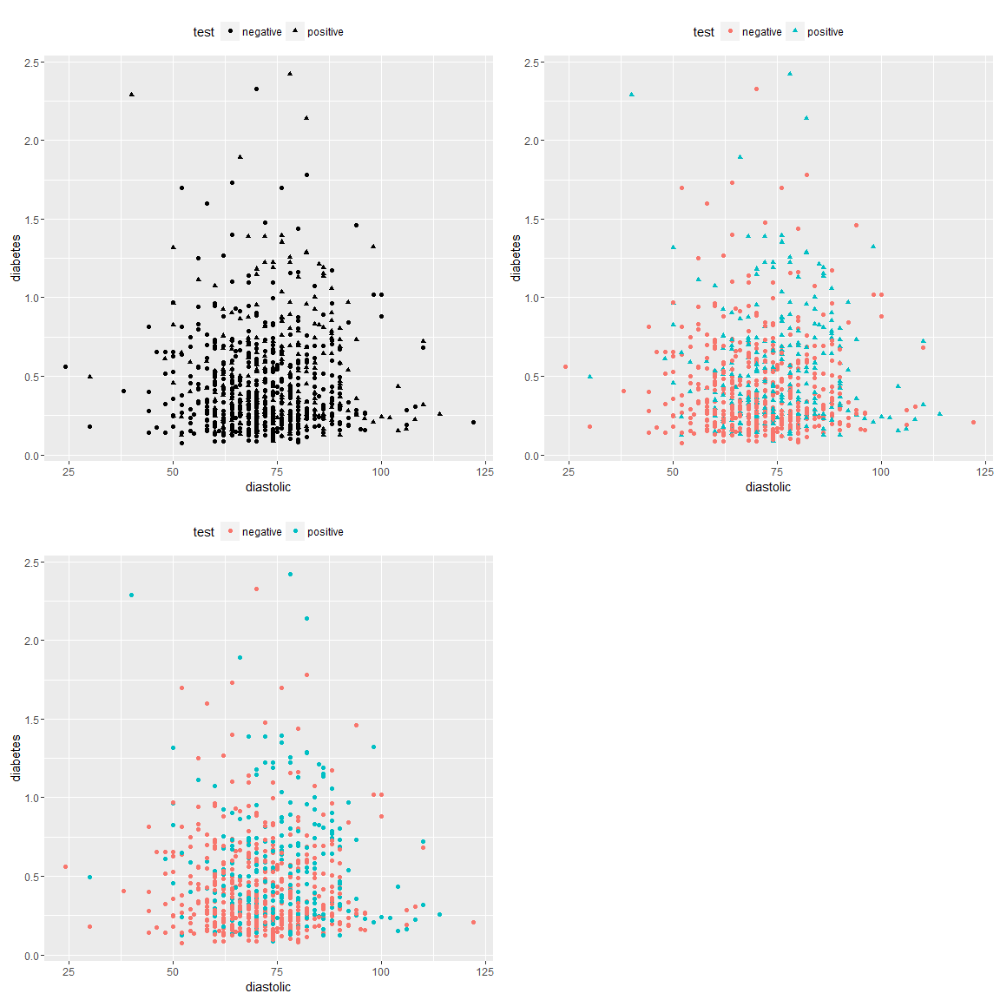
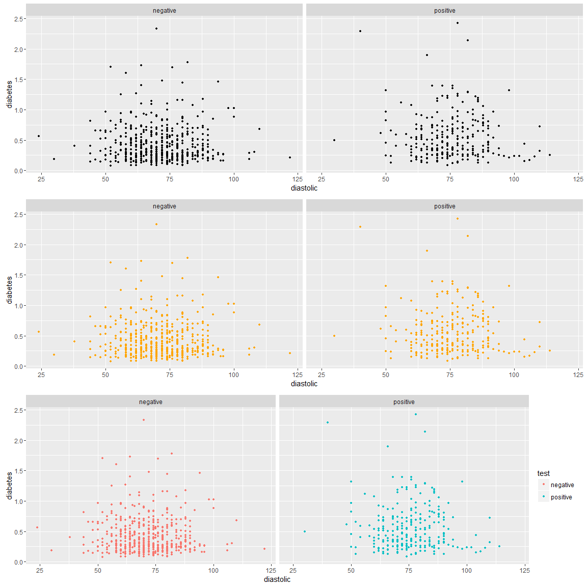
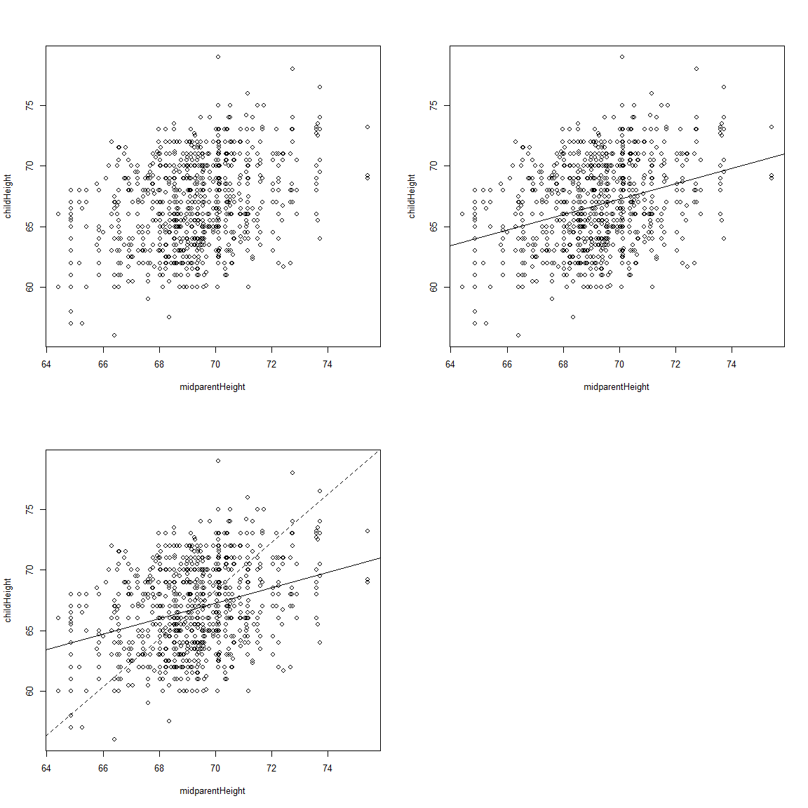

# TITLE

**About this document**
 About the document


# Load dataset, and do quick analysis
768 adult female Pima Indians living near Phoenix


```r
library(faraway)
library(dplyr)
library(ggplot2)

# make the data available from the faraway package
data(pima, package="faraway")
pima <- tbl_df(pima)
```

| Variable  | Description                      |
|-----------|----------------------------------|
| pregnant  | number of times pregnant         |
| glucose   | glucose concentration            |
| diastolic | Diastolic blood pressure (mmHg)  |
| triceps   | Triceps skin fold thickness (mm) |
| insulin   | 2-hour serum insulin (muU/ml)    |
| bmi       | weight in kg/(height in $m^2$)   |
| diabetes  | Diabetes pedigree function       |
| age       | In Years                         |
| test      | 0 if negative, 1 if positive     |


```r
head(pima)
```

```
## # A tibble: 6 × 9
##   pregnant glucose diastolic triceps insulin   bmi diabetes   age  test
##      <int>   <int>     <int>   <int>   <int> <dbl>    <dbl> <int> <int>
## 1        6     148        72      35       0  33.6    0.627    50     1
## 2        1      85        66      29       0  26.6    0.351    31     0
## 3        8     183        64       0       0  23.3    0.672    32     1
## 4        1      89        66      23      94  28.1    0.167    21     0
## 5        0     137        40      35     168  43.1    2.288    33     1
## 6        5     116        74       0       0  25.6    0.201    30     0
```

```r
# dplyr::glimpse(pima)
summary(pima)
```

```
##     pregnant         glucose        diastolic         triceps     
##  Min.   : 0.000   Min.   :  0.0   Min.   :  0.00   Min.   : 0.00  
##  1st Qu.: 1.000   1st Qu.: 99.0   1st Qu.: 62.00   1st Qu.: 0.00  
##  Median : 3.000   Median :117.0   Median : 72.00   Median :23.00  
##  Mean   : 3.845   Mean   :120.9   Mean   : 69.11   Mean   :20.54  
##  3rd Qu.: 6.000   3rd Qu.:140.2   3rd Qu.: 80.00   3rd Qu.:32.00  
##  Max.   :17.000   Max.   :199.0   Max.   :122.00   Max.   :99.00  
##     insulin           bmi           diabetes           age       
##  Min.   :  0.0   Min.   : 0.00   Min.   :0.0780   Min.   :21.00  
##  1st Qu.:  0.0   1st Qu.:27.30   1st Qu.:0.2437   1st Qu.:24.00  
##  Median : 30.5   Median :32.00   Median :0.3725   Median :29.00  
##  Mean   : 79.8   Mean   :31.99   Mean   :0.4719   Mean   :33.24  
##  3rd Qu.:127.2   3rd Qu.:36.60   3rd Qu.:0.6262   3rd Qu.:41.00  
##  Max.   :846.0   Max.   :67.10   Max.   :2.4200   Max.   :81.00  
##       test      
##  Min.   :0.000  
##  1st Qu.:0.000  
##  Median :0.000  
##  Mean   :0.349  
##  3rd Qu.:1.000  
##  Max.   :1.000
```

# Some data cleansing
The value of 0 appears to be used as a code-value for NANs


```r
sort(pima$diastolic)[1:50]
```

```
##  [1]  0  0  0  0  0  0  0  0  0  0  0  0  0  0  0  0  0  0  0  0  0  0  0
## [24]  0  0  0  0  0  0  0  0  0  0  0  0 24 30 30 38 40 44 44 44 44 46 46
## [47] 48 48 48 48
```

So let's replace with NA

http://stackoverflow.com/questions/27909000/set-certain-values-to-na-with-dplyr


```r
# pima$diastolic[pima$diastolic == 0]  <- NA
# pima$glucose[pima$glucose == 0] <- NA
# pima$triceps[pima$triceps == 0]  <- NA
# pima$insulin[pima$insulin == 0] <- NA
# pima$bmi[pima$bmi == 0] <- NA
pima <- pima %>% mutate(diastolic = replace(diastolic, diastolic == 0, NA))
pima <- pima %>% mutate(glucose   = replace(glucose, glucose == 0, NA))
pima <- pima %>% mutate(triceps   = replace(triceps, triceps == 0, NA))
pima <- pima %>% mutate(insulin   = replace(insulin, insulin == 0, NA))
pima <- pima %>% mutate(bmi       = replace(bmi, bmi == 0, NA))
```

This should be a factor datatype (not int)
(we don't want to compute stuff like *average zip code*)


```r
summary(pima$test) 
```

```
##    Min. 1st Qu.  Median    Mean 3rd Qu.    Max. 
##   0.000   0.000   0.000   0.349   1.000   1.000
```

```r
pima$test <- factor(pima$test)
summary(pima$test)
```

```
##   0   1 
## 500 268
```

```r
# this makes it more descriptive
levels(pima$test) <- c("negative","positive")
summary(pima$test)
```

```
## negative positive 
##      500      268
```

The summary from the "cleaned" data 


```r
summary(pima)
```

```
##     pregnant         glucose        diastolic         triceps     
##  Min.   : 0.000   Min.   : 44.0   Min.   : 24.00   Min.   : 7.00  
##  1st Qu.: 1.000   1st Qu.: 99.0   1st Qu.: 64.00   1st Qu.:22.00  
##  Median : 3.000   Median :117.0   Median : 72.00   Median :29.00  
##  Mean   : 3.845   Mean   :121.7   Mean   : 72.41   Mean   :29.15  
##  3rd Qu.: 6.000   3rd Qu.:141.0   3rd Qu.: 80.00   3rd Qu.:36.00  
##  Max.   :17.000   Max.   :199.0   Max.   :122.00   Max.   :99.00  
##                   NA's   :5       NA's   :35       NA's   :227    
##     insulin            bmi           diabetes           age       
##  Min.   : 14.00   Min.   :18.20   Min.   :0.0780   Min.   :21.00  
##  1st Qu.: 76.25   1st Qu.:27.50   1st Qu.:0.2437   1st Qu.:24.00  
##  Median :125.00   Median :32.30   Median :0.3725   Median :29.00  
##  Mean   :155.55   Mean   :32.46   Mean   :0.4719   Mean   :33.24  
##  3rd Qu.:190.00   3rd Qu.:36.60   3rd Qu.:0.6262   3rd Qu.:41.00  
##  Max.   :846.00   Max.   :67.10   Max.   :2.4200   Max.   :81.00  
##  NA's   :374      NA's   :11                                      
##        test    
##  negative:500  
##  positive:268  
##                
##                
##                
##                
## 
```

# Now we're ready to plot stuffs
## R's Base-graph system


```r
par(mfrow=c(2,3))
hist(pima$diastolic,xlab="Diastolic",main="")
plot(density(pima$diastolic,na.rm=TRUE),main="")
plot(sort(pima$diastolic),ylab="Sorted Diastolic")
plot(diabetes ~ diastolic,pima) # y-x plot using R-formula
plot(diabetes ~ test,pima)      # boxplot since x-argument is a factor
```

<!-- -->

## ggplot


```r
source('~/tak.R')
p1 <- ggplot(pima,aes(x=diastolic)) + geom_histogram()
p2 <- ggplot(pima,aes(x=diastolic)) + geom_density()
p3 <- ggplot(pima,aes(x=diastolic,y=diabetes)) + geom_point()
#http://www.cookbook-r.com/Graphs/Multiple_graphs_on_one_page_(ggplot2)/
multiplot(p1,p2,p3,cols=2)
```

```
## `stat_bin()` using `bins = 30`. Pick better value with `binwidth`.
```

```
## Warning: Removed 35 rows containing non-finite values (stat_bin).
```

```
## Warning: Removed 35 rows containing non-finite values (stat_density).
```

```
## Warning: Removed 35 rows containing missing values (geom_point).
```

<!-- -->

```r
# test ----
# for faceting: "color", "shape", "fill"
p4a <- ggplot(pima,aes(x=diastolic,y=diabetes,shape=test)) + 
       geom_point() + theme(legend.position = "top", legend.direction = "horizontal")
p4b <- ggplot(pima,aes(x=diastolic,y=diabetes,color=test)) + 
       geom_point() + theme(legend.position = "top", legend.direction = "horizontal")
p4c <- ggplot(pima,aes(x=diastolic,y=diabetes,color=test,shape=test)) + 
  geom_point() + theme(legend.position = "top", legend.direction = "horizontal")
multiplot(p4a,p4b,p4c,cols=2)
```

```
## Warning: Removed 35 rows containing missing values (geom_point).

## Warning: Removed 35 rows containing missing values (geom_point).

## Warning: Removed 35 rows containing missing values (geom_point).
```

<!-- -->

```r
p5a <- ggplot(pima,aes(x=diastolic,y=diabetes)) + 
  geom_point(size=1) + facet_grid(~ test)
p5b <- ggplot(pima,aes(x=diastolic,y=diabetes)) + 
  geom_point(size=1,color='orange') + facet_grid(~ test)
p5c <- ggplot(pima,aes(x=diastolic,y=diabetes,color=test)) + 
  geom_point(size=1) + facet_grid(~ test)
multiplot(p5a,p5b,p5c)
```

```
## Warning: Removed 35 rows containing missing values (geom_point).

## Warning: Removed 35 rows containing missing values (geom_point).

## Warning: Removed 35 rows containing missing values (geom_point).
```

<!-- -->

# Example: manilius data
$$\text{arc} = \beta + \alpha \text{sin-ang} + \gamma \text{cosang}$$


```r
data(manilius, package="faraway")
manilius <- tbl_df(manilius)
head(manilius)
```

```
## # A tibble: 6 × 4
##        arc sinang  cosang group
##      <dbl>  <dbl>   <dbl> <int>
## 1 13.16667 0.8836 -0.4682     1
## 2 13.13333 0.9996 -0.0282     1
## 3 13.20000 0.9899  0.1421     1
## 4 14.25000 0.2221  0.9750     3
## 5 14.70000 0.0006  1.0000     3
## 6 13.01667 0.9308 -0.3654     1
```

Approach1: divide group into 3 groups, and solve system of linear equations


```r
(moon3 <- aggregate(manilius[,1:3],list(manilius$group), sum))
```

```
##   Group.1      arc  sinang  cosang
## 1       1 118.1333  8.4987 -0.7932
## 2       2 140.2833 -6.1404  1.7443
## 3       3 127.5333  2.9777  7.9649
```

```r
solve(cbind(9,moon3$sinang,moon3$cosang), moon3$arc) # alpha,beta,gamma
```

```
## [1] 14.5445859 -1.4898221  0.1341264
```

Approach2: linear least squares (1805 Adrien Legendre)
$$arc_i = \beta + \alpha \text{sin-ang}_i + \gamma \text{cos-ang}_i +\varepsilon_i$$


```r
lmod <- lm(arc ~ sinang + cosang, manilius)
coef(lmod)
```

```
## (Intercept)      sinang      cosang 
## 14.56162351 -1.50458123  0.09136504
```

# Example: child-height prediction
$$childHeight = \alpha + \beta midparentHeight + \varepsilon$$


```r
data(GaltonFamilies, package="HistData")
GaltonFamilies <- tbl_df(GaltonFamilies)
head(GaltonFamilies)
```

```
## # A tibble: 6 × 8
##   family father mother midparentHeight children childNum gender
##   <fctr>  <dbl>  <dbl>           <dbl>    <int>    <int> <fctr>
## 1    001   78.5   67.0           75.43        4        1   male
## 2    001   78.5   67.0           75.43        4        2 female
## 3    001   78.5   67.0           75.43        4        3 female
## 4    001   78.5   67.0           75.43        4        4 female
## 5    002   75.5   66.5           73.66        4        1   male
## 6    002   75.5   66.5           73.66        4        2   male
## # ... with 1 more variables: childHeight <dbl>
```

```r
par(mfrow=c(2,2))
plot(childHeight ~ midparentHeight, GaltonFamilies)

lmod <- lm(childHeight ~ midparentHeight, GaltonFamilies)
coef(lmod)
```

```
##     (Intercept) midparentHeight 
##      22.6362405       0.6373609
```

```r
plot(childHeight ~ midparentHeight, GaltonFamilies)
abline(lmod)

(beta <- with(GaltonFamilies, cor(midparentHeight, childHeight) * sd(childHeight) / sd(midparentHeight)))
```

```
## [1] 0.6373609
```

```r
(alpha <- with(GaltonFamilies, mean(childHeight) - beta * mean(midparentHeight)))
```

```
## [1] 22.63624
```

```r
(beta1 <- with(GaltonFamilies, sd(childHeight) / sd(midparentHeight)))
```

```
## [1] 1.985858
```

```r
(alpha1 <- with(GaltonFamilies, mean(childHeight) - beta1 * mean(midparentHeight)))
```

```
## [1] -70.68889
```

```r
plot(childHeight ~ midparentHeight, GaltonFamilies)
abline(lmod)
abline(alpha1, beta1, lty=2) # dashed line
```

<!-- -->


---
title: "ch1.R"
author: "takanori"
date: "Wed Nov 23 18:30:26 2016"
---
