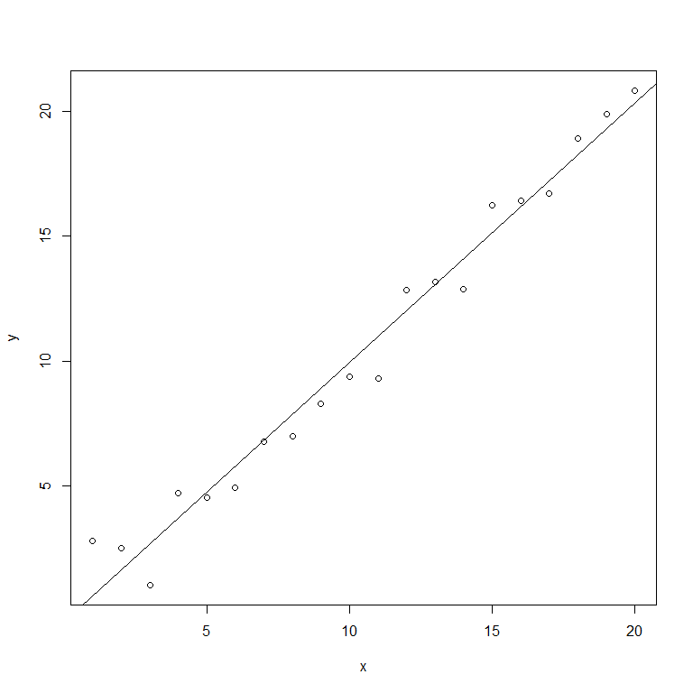
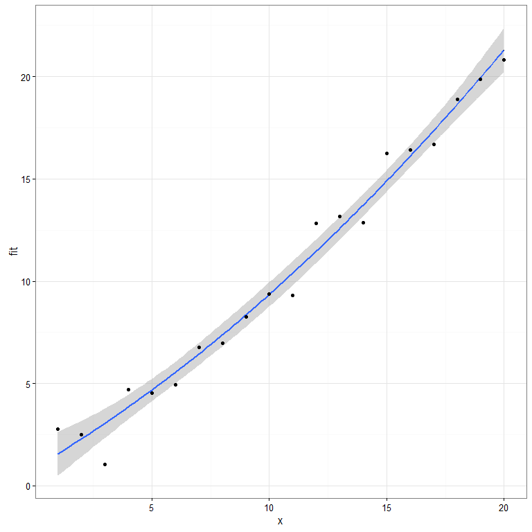

Ch2 - Estimation
""""""""""""""""
The source R script available :download:`here <ch2.Rmd>`

.. include:: /table-template-knitr.rst

.. contents:: `Contents`
    :depth: 2
    :local:

.. code-block:: R

    library(dplyr)
    library(faraway)
    library(ggplot2)

Load data
=========

.. code-block:: R

    data(gala, package="faraway")
    gala <- tbl_df(gala)
    # str(gala)

    # omit 2nd col (Endemics) from this analysis
    head(gala[,-2])

::

    ## # A tibble: 6 × 6
    ##   Species  Area Elevation Nearest Scruz Adjacent
    ##     <dbl> <dbl>     <dbl>   <dbl> <dbl>    <dbl>
    ## 1      58 25.09       346     0.6   0.6     1.84
    ## 2      31  1.24       109     0.6  26.3   572.33
    ## 3       3  0.21       114     2.8  58.7     0.78
    ## 4      25  0.10        46     1.9  47.4     0.18
    ## 5       2  0.05        77     1.9   1.9   903.82
    ## 6      18  0.34       119     8.0   8.0     1.84

.. code-block:: R

    dim(gala)

::

    ## [1] 30  7

.. code-block:: R

    # ls.str(gala)

Here the 2nd column will be omitted for the analysis.

-  Species = the number of species found on the island
-  Area = area of the island in :math:`km^2`
-  Elevation = highest elevation of the island (m)
-  Nearest = the distance from the nearest island (km)
-  Scruz = distance from Santa Cruz
-  Adjacent - the area of the adjacent island (km^2)

Fit linear model (Wilkinson-Rogers notation)
============================================

.. code-block:: R

    lmod <- lm(Species ~ Area + Elevation + Nearest + Scruz  + Adjacent, data=gala)

    # full regression summary (from R base)
    summary(lmod)

::

    ## 
    ## Call:
    ## lm(formula = Species ~ Area + Elevation + Nearest + Scruz + Adjacent, 
    ##     data = gala)
    ## 
    ## Residuals:
    ##      Min       1Q   Median       3Q      Max 
    ## -111.679  -34.898   -7.862   33.460  182.584 
    ## 
    ## Coefficients:
    ##              Estimate Std. Error t value Pr(>|t|)    
    ## (Intercept)  7.068221  19.154198   0.369 0.715351    
    ## Area        -0.023938   0.022422  -1.068 0.296318    
    ## Elevation    0.319465   0.053663   5.953 3.82e-06 ***
    ## Nearest      0.009144   1.054136   0.009 0.993151    
    ## Scruz       -0.240524   0.215402  -1.117 0.275208    
    ## Adjacent    -0.074805   0.017700  -4.226 0.000297 ***
    ## ---
    ## Signif. codes:  0 '***' 0.001 '**' 0.01 '*' 0.05 '.' 0.1 ' ' 1
    ## 
    ## Residual standard error: 60.98 on 24 degrees of freedom
    ## Multiple R-squared:  0.7658, Adjusted R-squared:  0.7171 
    ## F-statistic:  15.7 on 5 and 24 DF,  p-value: 6.838e-07

.. code-block:: R

    # abbreviated regression summary
    faraway::sumary(lmod)

::

    ##              Estimate Std. Error t value  Pr(>|t|)
    ## (Intercept)  7.068221  19.154198  0.3690 0.7153508
    ## Area        -0.023938   0.022422 -1.0676 0.2963180
    ## Elevation    0.319465   0.053663  5.9532 3.823e-06
    ## Nearest      0.009144   1.054136  0.0087 0.9931506
    ## Scruz       -0.240524   0.215402 -1.1166 0.2752082
    ## Adjacent    -0.074805   0.017700 -4.2262 0.0002971
    ## 
    ## n = 30, p = 6, Residual SE = 60.97519, R-Squared = 0.77

Fit linear model via closed form linear algebra notation
========================================================

.. code-block:: R

    # extract the x-matrix
    gala[1:5,]

::

    ## # A tibble: 5 × 7
    ##   Species Endemics  Area Elevation Nearest Scruz Adjacent
    ##     <dbl>    <dbl> <dbl>     <dbl>   <dbl> <dbl>    <dbl>
    ## 1      58       23 25.09       346     0.6   0.6     1.84
    ## 2      31       21  1.24       109     0.6  26.3   572.33
    ## 3       3        3  0.21       114     2.8  58.7     0.78
    ## 4      25        9  0.10        46     1.9  47.4     0.18
    ## 5       2        1  0.05        77     1.9   1.9   903.82

.. code-block:: R

    x <- model.matrix( ~ Area + Elevation + Nearest + Scruz  + Adjacent,gala)
    x[1:5,]

::

    ##           (Intercept)  Area Elevation Nearest Scruz Adjacent
    ## Baltra              1 25.09       346     0.6   0.6     1.84
    ## Bartolome           1  1.24       109     0.6  26.3   572.33
    ## Caldwell            1  0.21       114     2.8  58.7     0.78
    ## Champion            1  0.10        46     1.9  47.4     0.18
    ## Coamano             1  0.05        77     1.9   1.9   903.82

.. code-block:: R

    y <- gala$Species

    # a horrible way to to compute (X'X)^-1*X'*y
    xtxi <- solve(t(x) %*% x)
    xtxi %*% t(x) %*% y

::

    ##                     [,1]
    ## (Intercept)  7.068220709
    ## Area        -0.023938338
    ## Elevation    0.319464761
    ## Nearest      0.009143961
    ## Scruz       -0.240524230
    ## Adjacent    -0.074804832

.. code-block:: R

    # a little-bit better way (better to use lm()....which uses QR decomp)
    solve(crossprod(x,x),crossprod(x,y))

::

    ##                     [,1]
    ## (Intercept)  7.068220709
    ## Area        -0.023938338
    ## Elevation    0.319464761
    ## Nearest      0.009143961
    ## Scruz       -0.240524230
    ## Adjacent    -0.074804832

Let's study regression quantities from fitted model
===================================================

.. code-block:: R

    # regression quantities from the lm model
    names(lmod)

::

    ##  [1] "coefficients"  "residuals"     "effects"       "rank"         
    ##  [5] "fitted.values" "assign"        "qr"            "df.residual"  
    ##  [9] "xlevels"       "call"          "terms"         "model"

Estimate of noise-std-dev
-------------------------

.. math:: \hat{\sigma}^2 = \frac{RSS}{n-p}

.. code-block:: R

    n <- nrow(gala)
    p <- 6

    # quantities in the summary(lmod)
    lmodsum <- summary(lmod)
    names(lmodsum)

::

    ##  [1] "call"          "terms"         "residuals"     "coefficients" 
    ##  [5] "aliased"       "sigma"         "df"            "r.squared"    
    ##  [9] "adj.r.squared" "fstatistic"    "cov.unscaled"

.. code-block:: R

    # estimate of the \sigma (std-dev)
    sqrt(deviance(lmod)/df.residual(lmod))

::

    ## [1] 60.97519

.. code-block:: R

    # in closed form (sigma^2 = RSS / (n-p))
    dev_lmod <- sum(lmod$residuals**2)
    df_resid <- n-p
    sqrt(dev_lmod/df_resid)

::

    ## [1] 60.97519

.. code-block:: R

    # from summary
    lmodsum$sigma 

::

    ## [1] 60.97519

Get std-err of coefficients
---------------------------

.. math:: \text{se}(\hat{\beta}_{i-1})=\hat{\sigma}\sqrt{(X^TX)_{ii}^{-1}}

.. code-block:: R

    # extract (X'X)^-1, and use the diag components to compute std-err of coeffs
    xtxi <- lmodsum$cov.unscaled
    sqrt(diag(xtxi))*lmodsum$sigma 

::

    ## (Intercept)        Area   Elevation     Nearest       Scruz    Adjacent 
    ## 19.15419782  0.02242235  0.05366280  1.05413595  0.21540225  0.01770019

.. code-block:: R

    lmodsum$coef[,2] # from summary

::

    ## (Intercept)        Area   Elevation     Nearest       Scruz    Adjacent 
    ## 19.15419782  0.02242235  0.05366280  1.05413595  0.21540225  0.01770019

QR Decomposition (see book for more details)
============================================

.. code-block:: R

    qrx <- qr(x)
    dim(qr.Q(qrx))

::

    ## [1] 30  6

.. code-block:: R

    (f <- t(qr.Q(qrx)) %*% y)

::

    ##             [,1]
    ## [1,] -466.842193
    ## [2,]  381.405574
    ## [3,]  256.250473
    ## [4,]    5.407646
    ## [5,] -119.498340
    ## [6,]  257.694369

.. code-block:: R

    backsolve(qr.R(qrx),f) # to solve tiangular matrix

::

    ##              [,1]
    ## [1,]  7.068220709
    ## [2,] -0.023938338
    ## [3,]  0.319464761
    ## [4,]  0.009143961
    ## [5,] -0.240524230
    ## [6,] -0.074804832

Gauss-Markov Theorem
====================

There are 3 good reasons to use the method of LS:

1. It results from an orthogonal projection onto the model space. It
   makes sense geometrically.
2. If the errors are iid, it is the MLE, which is the value of
   :math:`\beta` that maximizes the probability of the data that was
   observed (loosely put).
3. The Gauss-Markov theorem states that :math:`\hat{\beta}` is the best
   linear unbiased estimate (BLUE).

Goodness of fit
===============

Coefficient of determination (aka *percentage of variance explained*)

.. math:: R^2 = 1 - \frac{\sum_i (\hat{y}_i-y_i)^2}{\sum_i (y_i-\bar{y})^2}=1-\frac{RSS}{\text{Total SS(Corrected for mean)}}

 # Identifiability

.. code-block:: R

    # deliberately introduce a linearly dependent variable
    gala$Adiff <- gala$Area -gala$Adjacent
    lmod <- lm(Species ~ Area+Elevation+Nearest+Scruz+Adjacent +Adiff,gala)

    # here we should get a message about singularity 
    # (X is now rank deficient - rank=6 < ncol=7)
    sumary(lmod)

::

    ## 
    ## Coefficients: (1 not defined because of singularities)
    ##              Estimate Std. Error t value  Pr(>|t|)
    ## (Intercept)  7.068221  19.154198  0.3690 0.7153508
    ## Area        -0.023938   0.022422 -1.0676 0.2963180
    ## Elevation    0.319465   0.053663  5.9532 3.823e-06
    ## Nearest      0.009144   1.054136  0.0087 0.9931506
    ## Scruz       -0.240524   0.215402 -1.1166 0.2752082
    ## Adjacent    -0.074805   0.017700 -4.2262 0.0002971
    ## 
    ## n = 30, p = 6, Residual SE = 60.97519, R-Squared = 0.77

.. code-block:: R

    # -- next add a small perturbation noise --
    set.seed(123)
    Adiffe <- gala$Adiff+0.001*(runif(30)-0.5)
    lmod <- lm(Species ~ Area+Elevation+Nearest+Scruz +Adjacent+Adiffe,gala)

    # this time, all parameters were estimated, but std-errs are very large
    # due to numerical instability
    sumary(lmod)

::

    ##                Estimate  Std. Error t value  Pr(>|t|)
    ## (Intercept)  3.2964e+00  1.9434e+01  0.1696    0.8668
    ## Area        -4.5123e+04  4.2583e+04 -1.0596    0.3003
    ## Elevation    3.1302e-01  5.3870e-02  5.8107 6.398e-06
    ## Nearest      3.8273e-01  1.1090e+00  0.3451    0.7331
    ## Scruz       -2.6199e-01  2.1581e-01 -1.2140    0.2371
    ## Adjacent     4.5123e+04  4.2583e+04  1.0596    0.3003
    ## Adiffe       4.5123e+04  4.2583e+04  1.0596    0.3003
    ## 
    ## n = 30, p = 7, Residual SE = 60.81975, R-Squared = 0.78

Orthogonality
=============

Goal -- determine the effects of the following factor towards reducing
the (unpleasant) **odor** in a chemical product:

-  column temperature
-  gas/liquid ratio
-  packing height

.. code-block:: R

    data(odor, package="faraway")
    odor[1:5,]

::

    ##   odor temp gas pack
    ## 1   66   -1  -1    0
    ## 2   39    1  -1    0
    ## 3   43   -1   1    0
    ## 4   49    1   1    0
    ## 5   58   -1   0   -1

.. code-block:: R

    str(odor)

::

    ## 'data.frame':    15 obs. of  4 variables:
    ##  $ odor: num  66 39 43 49 58 17 -5 -40 65 7 ...
    ##  $ temp: num  -1 1 -1 1 -1 1 -1 1 0 0 ...
    ##  $ gas : num  -1 -1 1 1 0 0 0 0 -1 1 ...
    ##  $ pack: num  0 0 0 0 -1 -1 1 1 -1 -1 ...

.. code-block:: R

    # the 3 predictors are orthogonal
    cov(odor[,-1])

::

    ##           temp       gas      pack
    ## temp 0.5714286 0.0000000 0.0000000
    ## gas  0.0000000 0.5714286 0.0000000
    ## pack 0.0000000 0.0000000 0.5714286

.. code-block:: R

    lmod <- lm(odor ~ temp + gas + pack, odor)
    # 2nd arg: ask for the correlation of coefficients
    # (here we see the correlation between coefficieents is zero)
    summary(lmod,cor=T) 

::

    ## 
    ## Call:
    ## lm(formula = odor ~ temp + gas + pack, data = odor)
    ## 
    ## Residuals:
    ##     Min      1Q  Median      3Q     Max 
    ## -50.200 -17.138   1.175  20.300  62.925 
    ## 
    ## Coefficients:
    ##             Estimate Std. Error t value Pr(>|t|)
    ## (Intercept)   15.200      9.298   1.635    0.130
    ## temp         -12.125     12.732  -0.952    0.361
    ## gas          -17.000     12.732  -1.335    0.209
    ## pack         -21.375     12.732  -1.679    0.121
    ## 
    ## Residual standard error: 36.01 on 11 degrees of freedom
    ## Multiple R-squared:  0.3337, Adjusted R-squared:  0.1519 
    ## F-statistic: 1.836 on 3 and 11 DF,  p-value: 0.1989
    ## 
    ## Correlation of Coefficients:
    ##      (Intercept) temp gas 
    ## temp 0.00                 
    ## gas  0.00        0.00     
    ## pack 0.00        0.00 0.00

.. code-block:: R

    # fit without the temperature 
    # (the coeffs do not change, but the residual SE changes slightly,
    #  leading to changes in the SEs of the coeffs, t-stats, and p-values)
    lmod <- lm(odor ~ gas + pack, odor)
    summary(lmod)

::

    ## 
    ## Call:
    ## lm(formula = odor ~ gas + pack, data = odor)
    ## 
    ## Residuals:
    ##     Min      1Q  Median      3Q     Max 
    ## -50.200 -26.700   1.175  26.800  50.800 
    ## 
    ## Coefficients:
    ##             Estimate Std. Error t value Pr(>|t|)
    ## (Intercept)   15.200      9.262   1.641    0.127
    ## gas          -17.000     12.683  -1.340    0.205
    ## pack         -21.375     12.683  -1.685    0.118
    ## 
    ## Residual standard error: 35.87 on 12 degrees of freedom
    ## Multiple R-squared:  0.2787, Adjusted R-squared:  0.1585 
    ## F-statistic: 2.319 on 2 and 12 DF,  p-value: 0.1408

Polynomial fit
==============

.. code-block:: R

    class(1:20)

::

    ## [1] "integer"

.. code-block:: R

    x <- as.double(1:20)
    class(x)

::

    ## [1] "numeric"

.. code-block:: R

    y <- x+rnorm(20)

    # simple linear regression
    mod1 <- lm(y~x)
    summary(mod1)

::

    ## 
    ## Call:
    ## lm(formula = y ~ x)
    ## 
    ## Residuals:
    ##      Min       1Q   Median       3Q      Max 
    ## -1.65760 -0.67706  0.03587  0.69494  2.20681 
    ## 
    ## Coefficients:
    ##             Estimate Std. Error t value Pr(>|t|)    
    ## (Intercept) -0.45898    0.47823   -0.96     0.35    
    ## x            1.03908    0.03992   26.03 9.78e-16 ***
    ## ---
    ## Signif. codes:  0 '***' 0.001 '**' 0.01 '*' 0.05 '.' 0.1 ' ' 1
    ## 
    ## Residual standard error: 1.029 on 18 degrees of freedom
    ## Multiple R-squared:  0.9741, Adjusted R-squared:  0.9727 
    ## F-statistic: 677.4 on 1 and 18 DF,  p-value: 9.784e-16

.. code-block:: R

    plot(y~x)
    abline(mod1)

|image0|\ 

-  http://stackoverflow.com/questions/2063821/do-i-always-have-to-use-data-frames-in-ggplot2
-  http://stackoverflow.com/questions/23334360/plot-polynomial-regression-curve-in-r

.. code-block:: R

    df <- data.frame(x=x,y=y)
    # polynomial fit
    mod2 <- lm(y~x+I(x^2),data=df)
    summary(mod2)

::

    ## 
    ## Call:
    ## lm(formula = y ~ x + I(x^2), data = df)
    ## 
    ## Residuals:
    ##     Min      1Q  Median      3Q     Max 
    ## -2.0232 -0.5207 -0.0331  0.3913  1.3646 
    ## 
    ## Coefficients:
    ##             Estimate Std. Error t value Pr(>|t|)    
    ## (Intercept) 0.874497   0.670611   1.304 0.209605    
    ## x           0.675406   0.147075   4.592 0.000259 ***
    ## I(x^2)      0.017318   0.006803   2.546 0.020896 *  
    ## ---
    ## Signif. codes:  0 '***' 0.001 '**' 0.01 '*' 0.05 '.' 0.1 ' ' 1
    ## 
    ## Residual standard error: 0.9014 on 17 degrees of freedom
    ## Multiple R-squared:  0.9813, Adjusted R-squared:  0.9791 
    ## F-statistic: 445.1 on 2 and 17 DF,  p-value: 2.082e-15

.. code-block:: R

    prd <- data.frame(x=seq(from = min(x), to = max(x), length.out = 100))
    err <- predict(mod2, newdata = prd, se.fit = TRUE)
    str(err)

::

    ## List of 4
    ##  $ fit           : Named num [1:100] 1.57 1.7 1.84 1.98 2.12 ...
    ##   ..- attr(*, "names")= chr [1:100] "1" "2" "3" "4" ...
    ##  $ se.fit        : Named num [1:100] 0.549 0.528 0.507 0.487 0.468 ...
    ##   ..- attr(*, "names")= chr [1:100] "1" "2" "3" "4" ...
    ##  $ df            : int 17
    ##  $ residual.scale: num 0.901

.. code-block:: R

    names(err)

::

    ## [1] "fit"            "se.fit"         "df"             "residual.scale"

.. code-block:: R

    prd$lci <- err$fit - 1.96 * err$se.fit
    prd$fit <- err$fit
    prd$uci <- err$fit + 1.96 * err$se.fit
    head(prd)

::

    ##          x       lci      fit      uci
    ## 1 1.000000 0.4914445 1.567221 2.642997
    ## 2 1.191919 0.6699584 1.704129 2.738300
    ## 3 1.383838 0.8483276 1.842314 2.836300
    ## 4 1.575758 1.0265185 1.981774 2.937029
    ## 5 1.767677 1.2044950 2.122509 3.040524
    ## 6 1.959596 1.3822195 2.264521 3.146822

.. code-block:: R

    ggplot(prd, aes(x = x, y = fit)) +
      theme_bw() +
      geom_line() +
      geom_smooth(aes(ymin = lci, ymax = uci), stat = "identity") +
      geom_point(data=df, aes(x = x, y = y))

|image1|\ 

