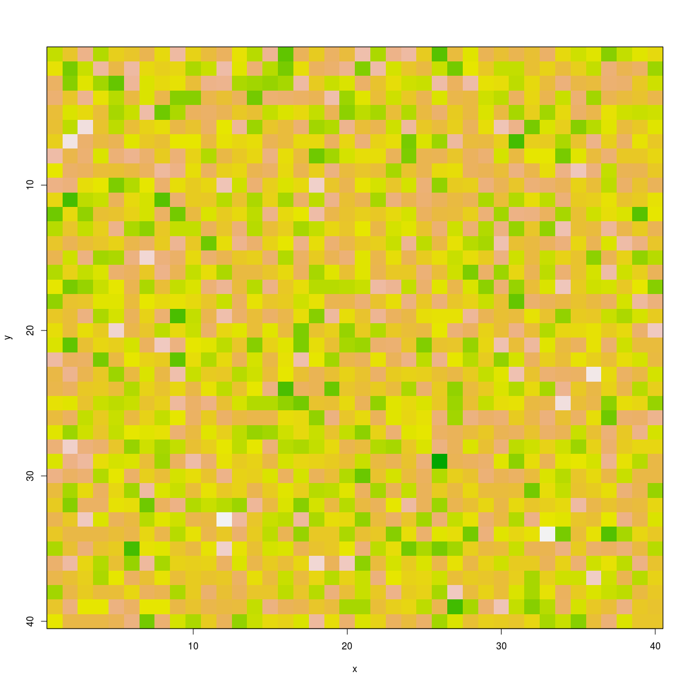
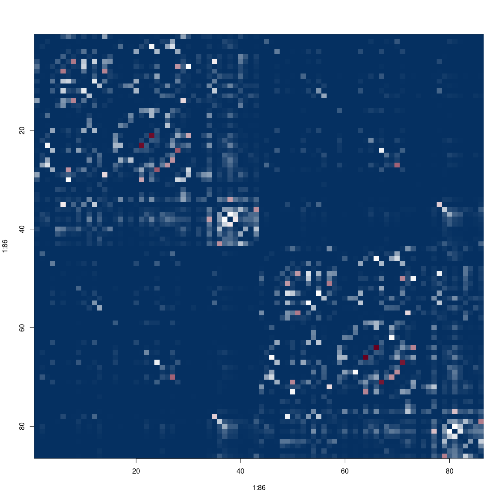
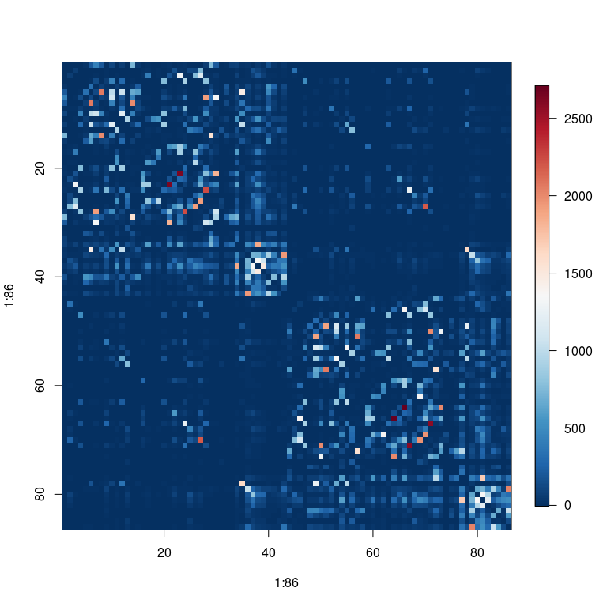
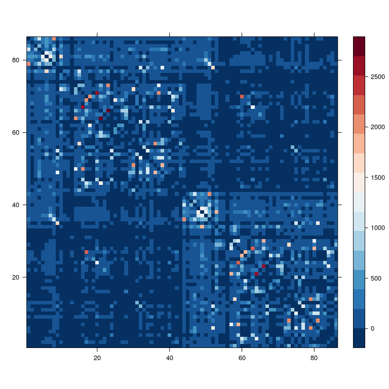

# image and heatmap try

**About this document**
 About the document


# HEADER-1


```r
set.seed(2)
source('tak.R')
# im <- matrix(rnorm(20),nrow = 4,ncol = 5)
im <- matrix(rnorm(40*40),nrow = 40,ncol = 40)
x <- 1:nrow(im)
y <- 1:ncol(im)


dim(im)
```

```
## [1] 40 40
```

```r
# image(x,y,im)
image(x,y,im,col = terrain.colors(100),
     ylim=c(ncol(im)+.5,0.5) # flip y axis
      #axes=FALSE, # add later
      )


box() # add border
```

<!-- -->

```r
# axis(2,at=y)
# legend()
# help("terrain.colors")
# ylim(5,1)

X <- R.matlab::readMat('tobpnc_drew.mat')$X
df <- read.csv('tobpnc_drew.csv')

# base plot ----
cmap <- colorRampPalette(c("#053061", "white", "#67001f"))(256) # <- RdBu_r
# cmap <- terrain.colors(100)
# help("terrain.colors")
Xpnc_mean <- dvecinv(colMeans(X[1:105,]))
image(1:86,1:86,Xpnc_mean,col = cmap,
      ylim=c(ncol(Xpnc_mean)+.5,0.5) # flip y axis
      #axes=FALSE, # add later
)
```

<!-- -->

```r
# try with legend ----
# http://stackoverflow.com/questions/8693558/how-to-define-fixed-aspect-ratio-for-scatter-plot

cmap <- colorRampPalette(c("#053061", "white", "#67001f"))(256) # <- RdBu_r
cmap <- colorRampPalette(c("blue", "white", "red"))(256) # <- RdBu_r
# output from t_1104_tob_pnc_check_R.py
cmap <- as.character(read.table('cmap_RdBu_r.txt')[[1]])

# https://www.datacamp.com/community/tutorials/15-questions-about-r-plots#gs.DOZLY_I
# https://www.image.ucar.edu/~nychka/Fields/Help/image.plot.html
```

```r
library(fields)
```

```r
image.plot(1:86,1:86,Xpnc_mean,col = cmap,
           # asp=1, # <- adds annoying surrounding box...so don't!
      # axes=FALSE, # add later
      ylim=c(ncol(Xpnc_mean)+.5,0.5) # flip y axis
)
```

<!-- -->

```r
# grid(86,86)
# axis(1,at=1:86)
# axis(2,at=seq(1,86,10),font.axis=250)
# box()
# below from t_1104_combat_dev.R. ----
jet.colors <-
  colorRampPalette(c("#00007F", "blue", "#007FFF", "cyan",
                     "#7FFF7F", "yellow", "#FF7F00", "red", "#7F0000"))
# cmap <- colorRampPalette(c("red", "white", "blue"))
# cmap <- colorRampPalette(c("blue", "white", "red"))

# === trying to get seismic from python ===
# -- references --
# t_1104_tob_pnc_check_R.py
# http://takwatanabe.me/snippets/cs-plotly.html#from-mpl-cm
# plt.cm.seismic(0), plt.cm.seismic(255)
# http://www.rapidtables.com/convert/color/rgb-to-hex.htm
# cmap <- colorRampPalette(c("#00004C", "white", "#7F0000"))
# cmap <- colorRampPalette(c("#00004D", "white", "#80000")) # <- seismic
cmap <- colorRampPalette(c("#053061", "white", "#67001f"))(256) # <- RdBu_r
# cmap <- RColorBrewer::brewer.pal(11, "RdBu")
# cmap <- RColorBrewer::brewer.pal("RdBu")

# output from t_1104_tob_pnc_check_R.py
# cmap <- as.character(read.table('cmap_RdBu_r.txt')[[1]])
cmap <- get_cmap_RdBu_r()
lattice::levelplot(Xpnc_mean,col.regions = cmap,xlab='',ylab='',row.values=86:1)
```

<!-- -->

```r
# lattice::levelplot(Xpnc_median,col.regions = jet.colors)

# try to make function ----
```


---
title: "demo_image.R"
author: "takanori"
date: "Thu Nov 17 13:42:15 2016"
---
